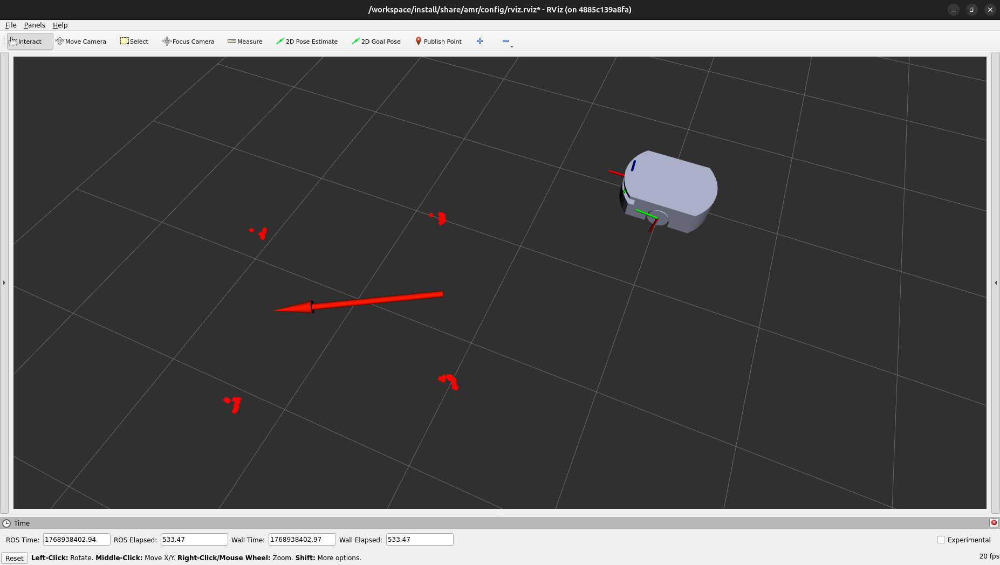
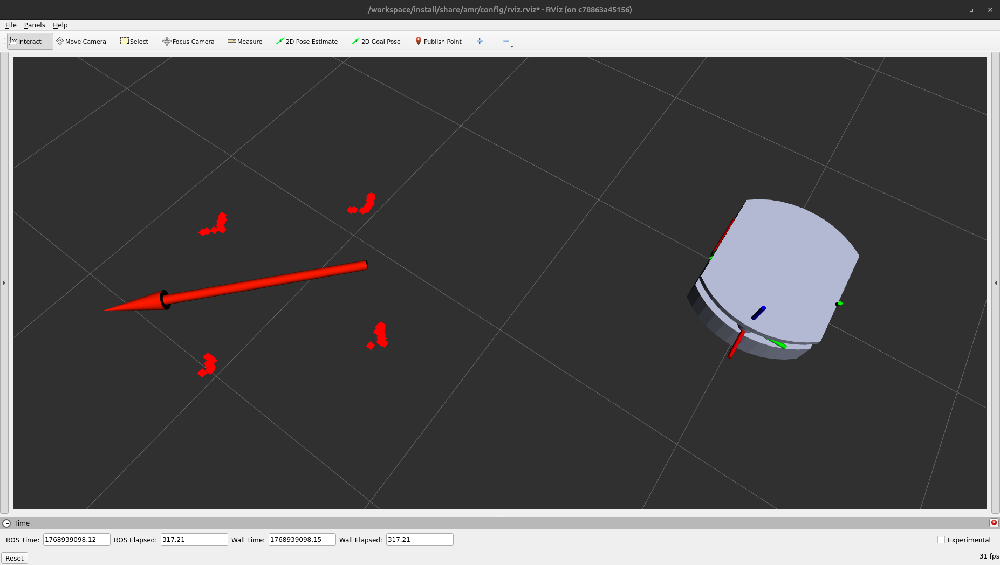
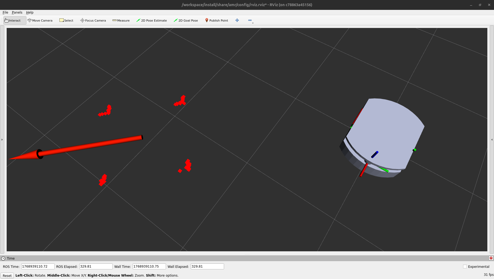
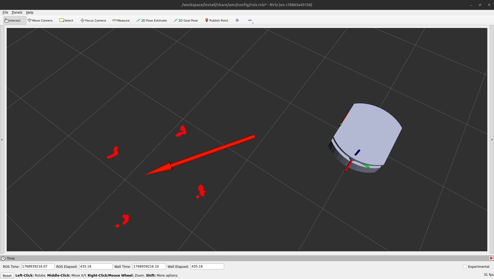
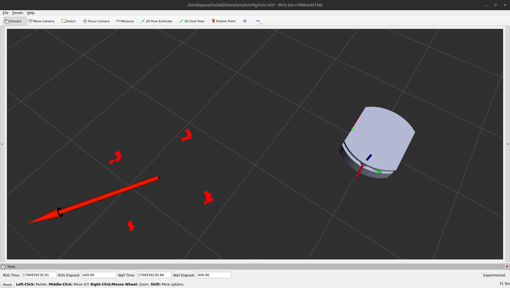

# Демонстрация работы алгоритма 
## Большой стелаж , leg_spacing: 1.5
### Проверим какую пару ног выбирает алгоритм, параметр entry_depth: 0
```
ros2 service call /find_rack amr/srv/FindRack "{leg_width: 0.1, leg_spacing: 1.5, entry_depth: 0}"
```


### Заезд под стелаж, параметр entry_depth: 0.75
```
ros2 service call /find_rack amr/srv/FindRack "{leg_width: 0.1, leg_spacing: 1.5, entry_depth: 0.75}"
```


## Маленький стелаж , leg_spacing: 0.8
### Проверим какую пару ног выбирает алгоритм, параметр entry_depth: 0
```
ros2 service call /find_rack amr/srv/FindRack "{leg_width: 0.1, leg_spacing: 0.8, entry_depth: 0}"
```


### Заезд под стелаж, параметр entry_depth: 0.4
```
ros2 service call /find_rack amr/srv/FindRack "{leg_width: 0.1, leg_spacing: 0.8, entry_depth: 0.40}"
```


## Два одинаковых стелажа leg_spacing: 1.0, проверяем что алгоритм выбирает ближайший к роботу  

```
ros2 service call /find_rack amr/srv/FindRack "{leg_width: 0.1, leg_spacing: 1, entry_depth: 0.50}"
```


## Интересное наблюдение 
Для более безопасного заезда под стеллаж можно вызвать сервис 2 раза, сначала с отрицательным парметром entry_dept, и величиной чуть больше чем половина длины робота (если если точка осчета - геометрический центр робота) чтобы робот сначала ровно подьехал к стелажу, затем вызвать сервис уже с необходимым парметром entry_dept чтобы робот заехал под стеллаж по прямой траектории 


